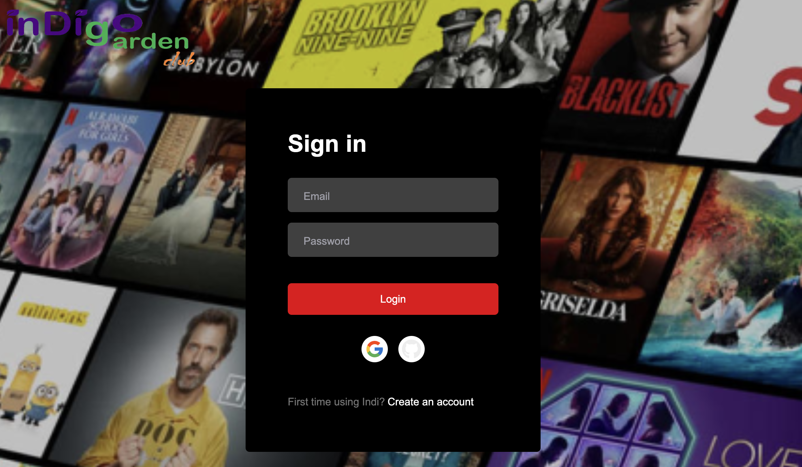

# [Indigo Garden Club](https://indigofool.com) 🚀

Welcome to **Indigo Garden Club** – a Next.js application where you can stream indie movies while supporting independent filmmakers by offering them higher margins. Enjoy a sleek, responsive interface built with modern web technologies and designed for an outstanding viewing experience.

---

## Description

Indigo Garden Club is a responsive web application that allows users to explore and stream a curated collection of indie films. With a focus on community and fair returns for filmmakers, the platform provides an intuitive interface, smooth streaming, and interactive features for movie enthusiasts.

TODO: Include impressive technologies used

---

## Screenshots

### Main Header


### Old Header (Legacy)


### Old Sign-In Screen (Legacy)


---

## Environment Variables

To run this project locally, create a `.env` file in the @/netflixclone directory with the following keys. **Do not disclose these secrets publicly!**
```
DATABASE_URL=

NEXTAUTH_JWT_SECRET=
NEXTAUTH_SECRET=
NEXTAUTH_URL=
NEXT_PUBLIC_API_BASE_URL=

GIT_CLIENT_ID=
GIT_CLIENT_SECRET=

GOOGLE_CLIENT_ID=
GOOGLE_CLIENT_SECRET=

MUX_TOKEN_ID=
MUX_TOKEN_SECRET=
```

---

## Terraform & GitHub Actions Deployment

This repository uses Terraform to deploy the application onto AWS via GitHub Actions. Ensure you have set up your AWS credentials appropriately before deployment. If you are working in a forked repository you will also need to set up the following Actions secrets for the deployment to run:
```
DATABASE_URL
ECR_REPOSITORY_URL
GIT_CLIENT_ID
GIT_CLIENT_SECRET
GOOGLE_CLIENT_ID
GOOGLE_CLIENT_SECRET
HOSTED_ZONE_ID
INDIGO_FOOL_VPC_ID
NEXTAUTH_JWT_SECRET
NEXTAUTH_SECRET
NEXTAUTH_URL
NEXT_PUBLIC_API_BASE_URL
VALIDATION_RECORD_FQDNS
MUX_TOKEN_ID
MUX_TOKEN_SECRET


AWS_ACCESS_KEY_ID
AWS_SECRET_ACCESS_KEY
```

---

## Deployment 🚀

### Install Dependencies

To install node follow this guide for node version manager [nvm installation](https://www.freecodecamp.org/news/node-version-manager-nvm-install-guide/). Or if you are on mac simply do
```bash
brew install node
```

Remember to first change your directory to either netflixclone or IndigoGardenCinemaClub or these commands will not work.

```bash
npm install
npx prisma generate
npm run dev
npm run build
npm run deploy
```

### Docker

To install Docker follow [this guide for Windows](https://www.youtube.com/watch?v=ZyBBv1JmnWQ). If you are on mac simply install [at the official site](https://docs.docker.com/desktop/setup/install/mac-install/). If you're on linux you can figure it out.

Docker is the fastest way to get both the current and the legacy app running locally at the same time. The legacy will run at port 3000 and the newer version will run at port 3001. Simply run the following command:

```bash
docker compose up --build
```

---

## System Requirements 💻
- **Node.js**: Version 14.x or higher
- **npm**: Version 6.x or higher
- **Terraform**: (For local deployment and managing AWS infrastructure)
- **AWS Account**: For production deployment

---

## Required Plugins & Dependencies 🛠️

This project relies on several plugins and dependencies to ensure a smooth development and deployment experience:
Dev Dependencies:
- **@types/lodash**: Type definitions for lodash.
- **concurrently**: Run multiple commands concurrently.
- **prisma**: ORM for managing and migrating your database schema.
- **wait-on**: Wait for files, ports, sockets, or http(s) resources to become available.
Dependencies:
- **@mux/mux-node**: Mux API client for Node.js.
- **@mux/mux-player-react**: React component for embedding the Mux Player.